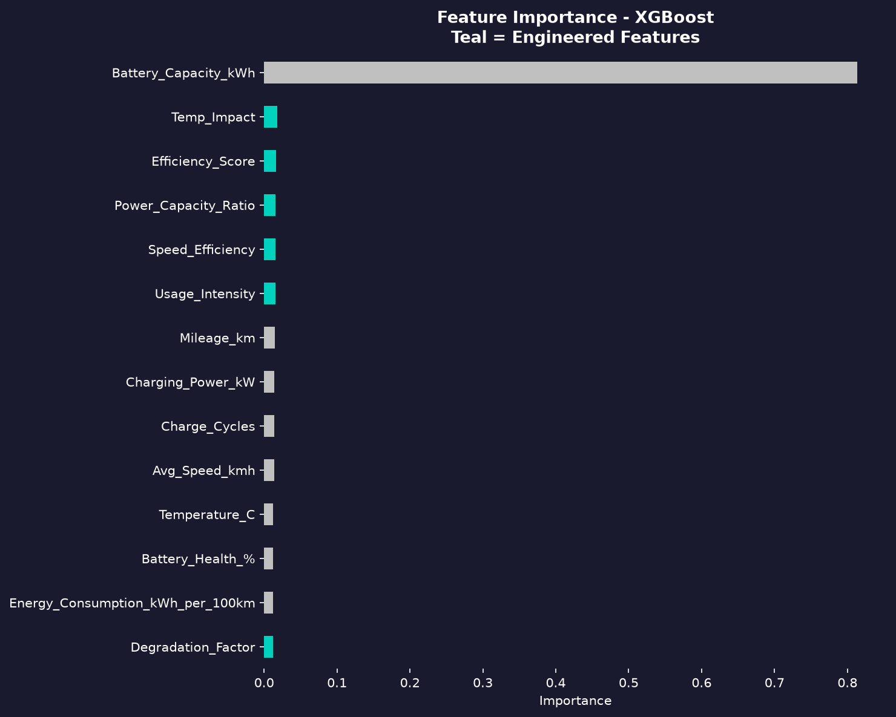
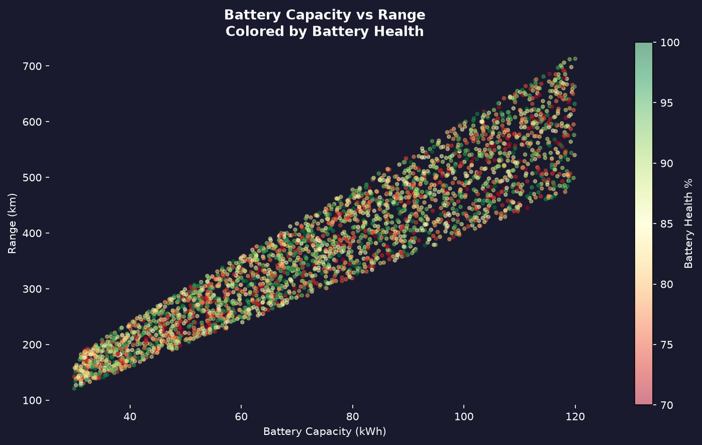
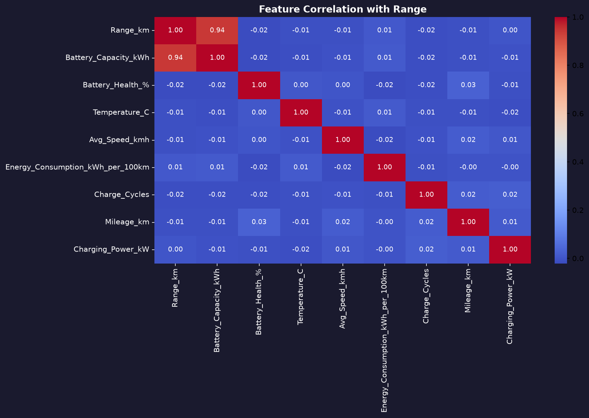

# EV Battery Range Predictor
### Predicting Electric Vehicle Range Using Machine Learning

An end-to-end machine learning project that predicts how far an electric vehicle can travel based on battery specifications and driving conditions. Features a live interactive Streamlit web app where you can adjust sliders and get real-time range predictions.

---

## Live Demo

Run locally:
```bash
streamlit run app.py
```

---

## What This Project Does

Given inputs like battery capacity, battery health, temperature, speed, and energy consumption, the model predicts the expected range of an electric vehicle in kilometers.

The project covers the full ML pipeline:
- Exploratory data analysis with correlation heatmaps and distribution plots
- Feature engineering to create domain-specific variables
- Training and comparing 4 models with 5-fold cross validation
- Hyperparameter tuning
- Deployment as an interactive Streamlit web app

---

## Feature Engineering

The raw dataset had one dominant feature (Battery_Capacity_kWh with 0.94 correlation to range). To build a more robust model, 6 new features were engineered:

| Feature | Formula | Rationale |
|---------|---------|-----------|
| Efficiency_Score | Battery_Capacity / Energy_Consumption | Higher capacity per kWh consumed = more range |
| Degradation_Factor | (100 - Battery_Health) / 100 | Captures real battery wear impact |
| Power_Capacity_Ratio | Charging_Power / Battery_Capacity | Charging efficiency indicator |
| Temp_Impact | abs(Temperature - 20) | Deviation from optimal 20C |
| Usage_Intensity | Mileage / (Charge_Cycles + 1) | How hard the battery has been used |
| Speed_Efficiency | Avg_Speed / Energy_Consumption | Speed vs consumption tradeoff |

---

## Model Comparison

All models trained with 5-fold cross validation to ensure generalization:

| Model | MAE | RMSE | R2 | CV R2 |
|-------|-----|------|----|-------|
| Linear Regression | 38.26 km | 47.08 km | 0.8782 | 0.8914 |
| Random Forest | 39.42 km | 48.93 km | 0.8685 | 0.8844 |
| Gradient Boosting | 39.39 km | 48.50 km | 0.8707 | 0.8864 |
| XGBoost | 40.09 km | 49.87 km | 0.8633 | 0.8784 |

Linear Regression performing best confirms that battery capacity dominates the prediction (0.94 correlation). XGBoost was selected for deployment due to its robustness and ability to capture non-linear interactions between engineered features.

All models show consistent CV R2 scores with low variance, confirming no overfitting.

---

## Key Findings

**Battery Capacity is King** - accounts for ~80% of predictive power, which aligns with real-world EV physics. A larger battery simply stores more energy.

**Temperature matters more than expected** - Temp_Impact became the second most important feature after engineering, showing that deviation from optimal temperature (20C) meaningfully reduces range.

**Battery health compounds over time** - A battery at 78% health loses ~22% effective range even with the same capacity. The Degradation_Factor feature captures this clearly.

**Consistency over complexity** - All 4 models achieve similar CV R2 (~0.88), suggesting the dataset relationship is fundamentally linear. Real-world EV data with more granular driving cycle features would benefit more from ensemble methods.

---

## Streamlit App Features

- Real-time range prediction as sliders update
- Three range estimates: predicted, effective (accounting for battery health), and highway
- Health impact delta showing km lost due to battery degradation
- Automatic warnings for extreme temperature, low battery health, high speed, and high charge cycles
- Efficiency score and degradation metrics displayed alongside predictions

---

## Visualizations

### Feature Importance - XGBoost


Teal bars are engineered features. Temp_Impact and Efficiency_Score appear in top features alongside Battery_Capacity_kWh.

### Battery Capacity vs Range (colored by Battery Health)


Green dots (healthy battery) sit higher for same capacity. Red dots (degraded) sit lower. Battery health visibly shifts the range even at identical capacities.

### Feature Correlation Heatmap


---

## Tech Stack

- **Python 3.14**
- **Scikit-learn** - Linear Regression, Random Forest, Gradient Boosting, cross validation
- **XGBoost** - Gradient boosted trees for deployment
- **Streamlit** - Interactive web application
- **Pandas / NumPy** - Data processing and feature engineering
- **Matplotlib / Seaborn** - Visualizations

---

## How to Run

**1. Clone the repo**
```bash
git clone https://github.com/sparsh1909/ev-battery-range-prediction.git
cd ev-battery-range-prediction
```

**2. Install dependencies**
```bash
pip install pandas numpy matplotlib seaborn scikit-learn xgboost streamlit
```

**3. Run EDA**
```bash
python3 eda.py
```

**4. Train models and engineer features**
```bash
python3 feature_engineering.py
```

**5. Launch the Streamlit app**
```bash
streamlit run app.py
```

---

## Dataset

Electric Vehicle Analytics Dataset from Kaggle. 3,000 records covering EV models across multiple regions with battery specs, driving conditions, and performance metrics.

Note: This dataset is synthetically generated with statistical realism. Real-world EV driving data would show stronger non-linear relationships between temperature, speed, and range.

---

## Author

**Sparsh Harwani**
[LinkedIn](https://linkedin.com/in/sparsh-harwani-313873213) | [GitHub](https://github.com/sparsh1909)

*AI and Data Science graduate targeting roles in automotive AI and ML engineering.*